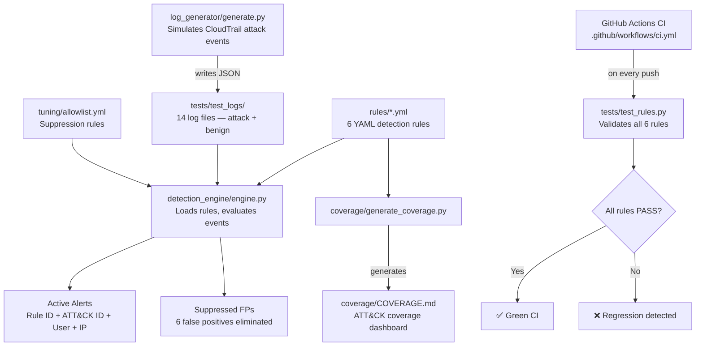

# Cloud-Trail-Detector

> CI/CD-tested detection-as-code pipeline for AWS CloudTrail with MITRE ATT&CK-mapped rules and automated validation.

[](https://github.com/AbhinavVijayvergia/Cloud-Trail-Detector/actions)

---

## What This Is

A detection engineering pipeline that:
- Ingests **AWS CloudTrail** JSON logs (simulated, realistic events)
- Evaluates **YAML-defined detection rules**, each mapped to a **MITRE ATT&CK** technique
- **Auto-validates** every rule against simulated attack scenarios via **GitHub Actions CI**
- Measures and reduces **false positives** with an allowlist-based suppression layer
- Generates an **ATT&CK coverage dashboard** showing detection coverage and confidence

Built entirely on AWS Free Tier. No paid infrastructure.

---

## Architecture



---

## Tools & Versions

| Tool | Version | Purpose |
|------|---------|---------|
| Python | 3.10+ | Detection engine, log generator, tests |
| PyYAML | 6.0+ | Parse YAML detection rules |
| GitHub Actions | N/A | CI/CD pipeline — validates rules on every push |
| AWS CloudTrail | N/A | Log format (simulated, not live AWS) |
| MITRE ATT&CK | v15 | Technique mapping framework |

---

## Repo Structure

    Cloud-Trail-Detector/
    ├── .github/workflows/      # GitHub Actions CI pipeline
    │   └── ci.yml
    ├── detection_engine/       # Core engine — loads rules, evaluates logs
    │   └── engine.py
    ├── rules/                  # YAML detection rules (1 per ATT&CK technique)
    │   ├── SCHEMA.md
    │   ├── t1078_iam_key_creation.yml
    │   ├── t1087_account_discovery.yml
    │   ├── t1110_brute_force.yml
    │   ├── t1530_s3_enumeration.yml
    │   ├── t1548_role_assumption.yml
    │   └── t1562_disable_cloudtrail.yml
    ├── log_generator/          # Generates simulated CloudTrail JSON logs
    │   └── generate.py
    ├── tests/
    │   ├── test_rules.py       # CI test harness — attack + benign per rule
    │   └── test_logs/          # 14 JSON log files
    ├── tuning/
    │   └── allowlist.yml       # False-positive suppression rules
    ├── coverage/
    │   ├── COVERAGE.md         # Auto-generated ATT&CK coverage dashboard
    │   └── generate_coverage.py
    ├── docs/investigations/    # Per-technique investigation write-ups
    ├── screenshots/            # Evidence screenshots
    └── PROJECT_LOG.md          # Dated build progress log

---

## Detection Rules

| # | ATT&CK ID | Technique | Tactic | Rule File | Severity |
|---|-----------|-----------|--------|-----------|----------|
| 1 | [T1078](https://attack.mitre.org/techniques/T1078/) | Valid Accounts | Persistence | `t1078_iam_key_creation.yml` | High |
| 2 | [T1530](https://attack.mitre.org/techniques/T1530/) | Data from Cloud Storage Object | Collection | `t1530_s3_enumeration.yml` | Medium |
| 3 | [T1548](https://attack.mitre.org/techniques/T1548/) | Abuse Elevation Control Mechanism | Privilege Escalation | `t1548_role_assumption.yml` | High |
| 4 | [T1110](https://attack.mitre.org/techniques/T1110/) | Brute Force | Credential Access | `t1110_brute_force.yml` | High |
| 5 | [T1087](https://attack.mitre.org/techniques/T1087/) | Account Discovery | Discovery | `t1087_account_discovery.yml` | Medium |
| 6 | [T1562](https://attack.mitre.org/techniques/T1562/) | Impair Defenses | Defense Evasion | `t1562_disable_cloudtrail.yml` | Critical |

Each rule is defined in YAML following the schema in [`rules/SCHEMA.md`](rules/SCHEMA.md). Fields: ATT&CK mapping, detection conditions, severity, false positive notes, references.

---

## How Rules Work

A detection rule is a YAML file with a `detection.match` block. The engine evaluates every CloudTrail event against every rule. All fields must match (AND logic). List values use OR logic within a field.

Example rule (`t1078_iam_key_creation.yml`):

```yaml
id: CTD-001
name: "IAM Access Key Creation"
severity: high

mitre:
  technique_id: "T1078"
  technique_name: "Valid Accounts"
  tactic: "Persistence"

detection:
  match:
    eventSource: "iam.amazonaws.com"
    eventName: "CreateAccessKey"
```

---

## How to Run

**Requirements**: Python 3.10+

```bash
# Install dependencies
pip install -r requirements.txt

# Generate simulated CloudTrail attack + benign logs
python -m log_generator.generate

# Run the detection engine against all test logs
python -m detection_engine.engine

# Run the CI test suite (all 6 rules — attack + benign validation)
python tests/test_rules.py

# Regenerate the ATT&CK coverage dashboard
python coverage/generate_coverage.py
```

---

## Results

### CI Validation — 6/6 Rules Passing

All 6 detection rules are validated automatically on every push via GitHub Actions. Each rule is tested against a "should fire" (attack) log and a "should NOT fire" (benign) log.

### Detection Engine Output

Running the engine against all simulated logs produces ATT&CK-mapped alerts with rule ID, severity, technique, user, source IP, and timestamp.

### False Positive Tuning

Measured on a mixed batch of 28 CloudTrail events (attack + benign activity combined):

| Metric | Before Tuning | After Tuning |
|--------|--------------|--------------|
| Total alerts fired | 14 | 8 |
| True positives | 8 | 8 |
| False positives | 6 | 0 |
| FP rate | 43% | **0%** |
| True positives lost | — | 0 |

**FP reduction: 43% → 0% with zero detection loss.**

FPs eliminated:
- `CTD-003` (T1548): Lambda functions assuming execution roles from internal IPs — 4 alerts suppressed
- `CTD-005` (T1087): Scheduled compliance scanner from internal network — 2 alerts suppressed

---

## Coverage Dashboard

See [`coverage/COVERAGE.md`](coverage/COVERAGE.md) for the full ATT&CK technique coverage matrix — technique IDs, test status, confidence levels, and FP tuning results.

---

## Investigation Notes

Per-technique analysis in [`docs/investigations/`](docs/investigations/):

| Technique | Write-up |
|-----------|----------|
| T1078 — Valid Accounts | [T1078_valid_accounts.md](docs/investigations/T1078_valid_accounts.md) |
| T1530 — Data from Cloud Storage | [T1530_cloud_storage.md](docs/investigations/T1530_cloud_storage.md) |
| T1548 — Privilege Escalation | [T1548_privilege_escalation.md](docs/investigations/T1548_privilege_escalation.md) |
| T1110 — Brute Force | [T1110_brute_force.md](docs/investigations/T1110_brute_force.md) |
| T1087 — Account Discovery | [T1087_account_discovery.md](docs/investigations/T1087_account_discovery.md) |
| T1562 — Impair Defenses | [T1562_impair_defenses.md](docs/investigations/T1562_impair_defenses.md) |

---

## Limitations & Future Work

- **Simulated data**: All logs are generated locally using the real CloudTrail 
  JSON schema. Connecting to live CloudTrail via S3 or Kinesis Data Streams 
  is the next step.
- **Scale**: The current engine processes events sequentially. 
  For high-volume environments (thousands of events/sec), the next iteration 
  would use parallel processing (multiprocessing/asyncio) or stream processing 
  (Apache Kafka or AWS Kinesis).
- **Correlation**: Rules currently match on single events. Time-windowed 
  correlation (e.g., "5 failed logins within 60 seconds") would reduce 
  false negatives for slow brute force attacks.

## Project Log

See [`PROJECT_LOG.md`](PROJECT_LOG.md) for dated build progress.

---

## Author

**Abhinav Vijayvergia**
- GitHub: [@AbhinavVijayvergia](https://github.com/AbhinavVijayvergia)

